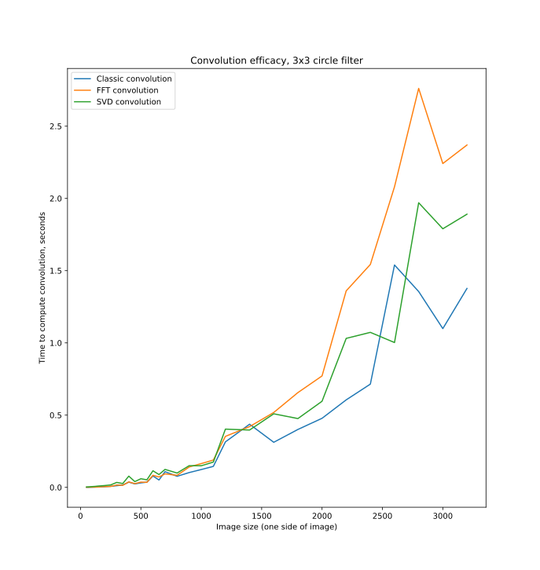
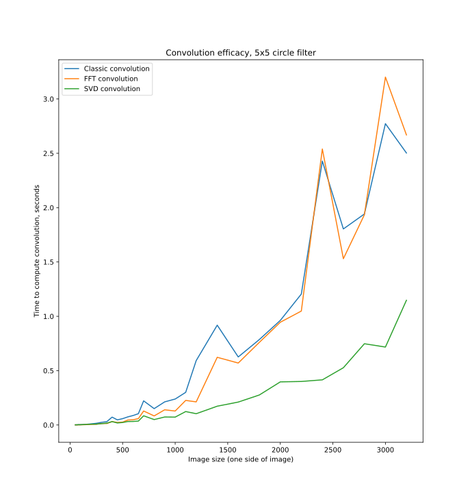
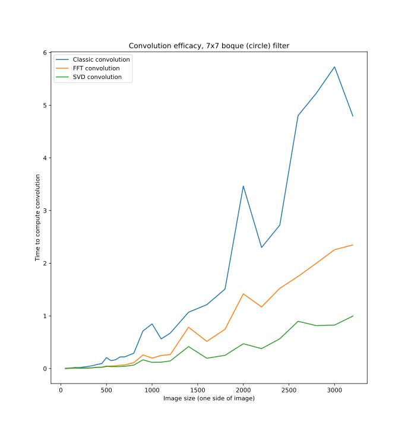

# SVD convolutions

This is an implementation of an algorithm for appoximate convolutions in linear time, lol.

# Results

## Test run results

We tested on randomly genrated grayscale images.
We used these functions:

-   `numpy.convolve2d`

-   `scipy.signal.fftconvolve`

-   Our own implementation of SVD concvolutions

    

## Images

Here is the image generated by a 5x5 circular filter with classic convolutions:

Here is the image generated by a 5x5 circular filter with out implementation:

## Link to testing

[Here is the link to a jupyter notebook with tests](https://colab.research.google.com/drive/1f0DaTNmfcXuE7KghYqYxnhs1f-r5MlVU?usp=sharing)
